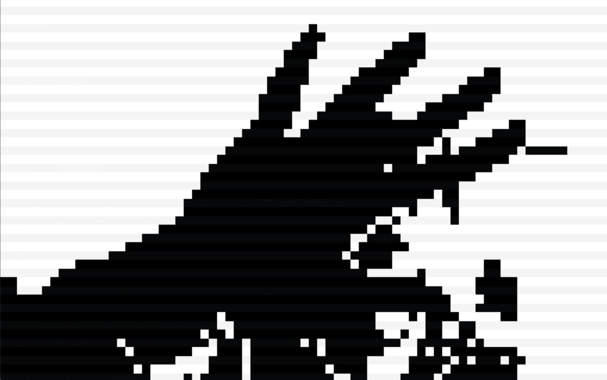
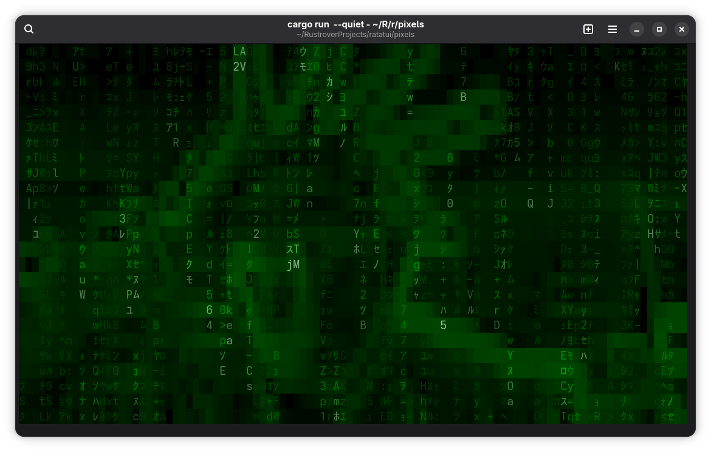

Matrix effect in terminal


# Rust Terminal Camera Viewer

A high-performance terminal-based live camera viewer written in Rust. It uses **Ratatui** for rendering, **v4l** for Linux camera capture.

Inspired by the series "Doctor Who" 


## Features

- **Multiple Render Modes**:
  - **Half-block mode**: Uses Unicode half-block `▀` characters for high-resolution color display.
  - **ASCII mode**: Maps camera feed to ASCII characters while retaining color.
  - **Matrix mode**: Maps camera feed to ASCII Matrix move style.
- **Real-time Filters**: Apply various color filters (Grayscale, Sepia, Invert, Vaporwave, etc.).
- **Bilinear Sampling**: Smooth interpolation (Anti-aliasing) for better image quality.
- **Screenshots**: Save the current frame as both an **ANSI-encoded text file** (preserving terminal colors) and a **PNG image**.
- **Performance**: Parallel YUV to RGB decoding and rendering using Rayon.
- **Clean UI**: Minimalist overlay with status information and a built-in help menu.

## Prerequisites

On Linux, you need `libv4l-dev` and fonts  installed:

```bash
# Ubuntu/Debian
sudo apt update
sudo apt install libv4l-dev
sudo apt install fonts-noto-mono fonts-noto-cjk fonts-jetbrains-mono

or 

#Arch Linux
sudo pacman -Syu
sudo pacman -S libv4l v4l-utils noto-fonts noto-fonts-cjk ttf-jetbrains-mono
```

## Installation & Usage

1. Clone the repository:
   ```bash
   git clone https://github.com/gofmanaa/pixels.git
   cd pixels
   ```

2. Run the application:
   ```bash
   # Using default device (/dev/video0)
   cargo run --release

   # Specifying a different device
   cargo run --release -- --device /dev/video1
   ```

## Keyboard Controls

| Key     | Action                                      |
|---------|---------------------------------------------|
| `q`     | Quit application                            |
| `a`     | Cycle Render Mode (Half-block/ASCII/Matrix) |
| `s`     | Toggle Bilinear Sampling (Anti-aliasing)    |
| `p`     | Save Screenshot (ANSI & PNG)                |
| `Space` | Toggle Pause/Live feed                      |
| `c`     | Toggle Stats Overlay                        |
| `h`     | Toggle Help Menu                            |
| `1..0`  | Switch between 10 different Color Filters   |

## Screenshots

Press `p` to save the current frame. Files are named `frame_{timestamp}.ansi` and `frame_{timestamp}.png`.

- **ANSI files** can be viewed with `cat` or `less -R`.
- **PNG files** are standard images.


## License

This project is licensed under the MIT License.
